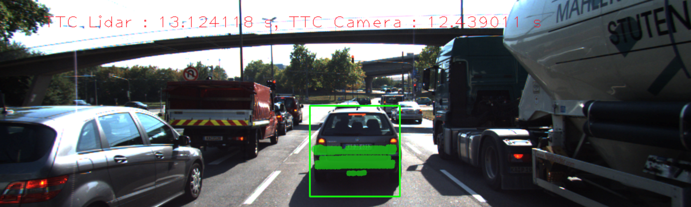

# SFND 3D Object Tracking

This is the final project for camera part. This projects covers following aspects in the direction of sensor fusion:

 - Key points detectors and descriptors (as done in previous project)
 - Deep learning approach using YOLO for object detection
 - Using key points matching and bounding boxes between successive images
 - Combining lidar points and camera images in 3D space


The flow chart provides gives an overview of the project. In the previous project the part in the orange box was point of focus. In this
project the part in blue box is the main focus. The target of the project is the estimation of time-to-collision (TTC) with the front vehicle
using camera and lidar sensors data.


## Basic Build Instructions

1. Clone this repo.
2. In `dat/yolo/` folder, download `yolov3.weights` and `yolov3-tiny.weights` files: `./download_weights.sh`
3. Make a build directory in the top level project directory: `mkdir build && cd build`
4. Compile: `cmake .. && make`
5. Run it: `./3D_object_tracking`.

## [Rubric](https://review.udacity.com/#!/rubrics/2550/view) Points
---

### FP.0 Final Report

### FP.1 Match 3D Objects
* Implement the method "matchBoundingBoxes", which takes as input both the previous and the current data frames and provides as output the ids of the matched regions of interest (i.e. the boxID property). 
* Matches must be the ones with the highest number of key point correspondences.

### (Answer):
* In this step , I iterate over the all match points and found out for each current point if it exit in ROI in current bounding box and query point in previous frame bounding box.  
*  I then counted the keypoint correspondences per box pair to determine the best matches between frames. Look at the code below

```c++
void matchBoundingBoxes(std::vector<cv::DMatch> &matches, std::map<int, int> &bbBestMatches, DataFrame &prevFrame, DataFrame &currFrame)
{
     int pervious_boundingboxes = prevFrame.boundingBoxes.size();
     int current_boundingboxes = currFrame.boundingBoxes.size();
     int point_counts[pervious_boundingboxes][current_boundingboxes] = { };
   
     for (auto it = matches.begin(); it != matches.end() - 1; ++it)     
	 {
        cv::KeyPoint perv_frame_point = prevFrame.keypoints[it->queryIdx];
        cv::Point poi_pervious = cv::Point(perv_frame_point.pt.x, perv_frame_point.pt.y);
        bool pervious_point_found = false;
		
		
        cv::KeyPoint current_frame_point = currFrame.keypoints[it->trainIdx];
        cv::Point poi_current  = cv::Point(current_frame_point.pt.x, current_frame_point.pt.y);
        bool current_point_found = false;
		
        std::vector<int> perv_id, curr_id;
		
		
        for (int i = 0; i < pervious_boundingboxes; i++) {
            if (prevFrame.boundingBoxes[i].roi.contains(poi_pervious))          
               {
                pervious_point_found = true;
                perv_id.push_back(i);
               }
        }
        for (int i = 0; i < current_boundingboxes; i++) {
            if (currFrame.boundingBoxes[i].roi.contains(poi_current)) 
               {
                current_point_found= true;
                curr_id.push_back(i);
               }
        }
        if (pervious_point_found && current_point_found)
        {
            for (auto id_prev: perv_id)
                for (auto id_curr: curr_id)
                     point_counts[id_prev][id_curr] += 1;
        }
    }

    for (int i = 0; i < pervious_boundingboxes; i++)
    {
         int max_count = 0;
         int id_max = 0;
         for (int j = 0; j < current_boundingboxes; j++)
             if (point_counts[i][j] > max_count)
             {
                  max_count = point_counts[i][j];
                  id_max = j;
             }
          bbBestMatches[i] = id_max;
    }

}

```


### FP.2 Compute Lidar-based TTC
* Compute the time-to-collision in second for all matched 3D objects using only Lidar measurements from the matched bounding boxes between current and previous frame.

### (Answer):
* In this step I estimate the TTC from lidar . First I filter out all point exist outside the Ego Lane for both Previous and current measurement
* Then I calculate the average for both the  Previous and current measurement.


```c++
void computeTTCLidar(std::vector<LidarPoint> &lidarPointsPrev,
                     std::vector<LidarPoint> &lidarPointsCurr, double frameRate, double &TTC)
{
    // ...
    double dT = 1 / frameRate;
    double laneWidth = 4.0; // assumed width of the ego lane
    vector<double> xPrev, xCurr;
    // find Lidar points within ego lane
    for (auto it = lidarPointsPrev.begin(); it != lidarPointsPrev.end(); ++it)
    {
        if (abs(it->y) <= laneWidth / 2.0)
        { // 3D point within ego lane?
            xPrev.push_back(it->x);
        }
    }
    for (auto it = lidarPointsCurr.begin(); it != lidarPointsCurr.end(); ++it)
    {
        if (abs(it->y) <= laneWidth / 2.0)
        { // 3D point within ego lane?
            xCurr.push_back(it->x);
        }
    }
    double minXPrev = 0;
    double minXCurr = 0;
    if (xPrev.size() > 0)
    {
       for (auto x: xPrev)
            minXPrev += x;
       minXPrev = minXPrev / xPrev.size();
    }
    if (xCurr.size() > 0)
    {
       for (auto x: xCurr)
           minXCurr += x;
       minXCurr = minXCurr / xCurr.size();
    }
    // compute TTC from both measurements
    cout << "minXCurr: " << minXCurr << endl;
    cout << "minXPrev: " << minXPrev << endl;
    TTC = minXCurr * dT / (minXPrev - minXCurr);
}
```
### FP.3 Associate Keypoint Correspondences with Bounding Boxes
* Prepare the TTC computation based on camera measurements by associating keypoint correspondences to the bounding boxes which enclose them. 
* All matches which satisfy this condition must be added to a vector in the respective bounding box.

### (Answer):
* In this step first I filter out all match points in "kptMatches" which are not enclosed in ROI of current bounding box in one local std::vector.
* After that I have taken mean of distances of all points to apply ratio test to set the threshold.
* Then I update the  kptMatches with all points which are greater than threshold.

```c++
void clusterKptMatchesWithROI(BoundingBox &boundingBox, std::vector<cv::KeyPoint> &kptsPrev, std::vector<cv::KeyPoint> &kptsCurr, std::vector<cv::DMatch> &kptMatches)
{
    // ...
    double dist_mean = 0;
    std::vector<cv::DMatch>  kptMatches_roi;
    for (auto it = kptMatches.begin(); it != kptMatches.end(); ++it)
    {
        cv::KeyPoint kp = kptsCurr.at(it->trainIdx);
        if (boundingBox.roi.contains(cv::Point(kp.pt.x, kp.pt.y)))
            kptMatches_roi.push_back(*it);
     }
    for  (auto it = kptMatches_roi.begin(); it != kptMatches_roi.end(); ++it)
         dist_mean += it->distance;
    cout << "Find " << kptMatches_roi.size()  << " matches" << endl;
    if (kptMatches_roi.size() > 0)
         dist_mean = dist_mean/kptMatches_roi.size();
    else return;
    double threshold = dist_mean * 0.7;
    for  (auto it = kptMatches_roi.begin(); it != kptMatches_roi.end(); ++it)
    {
       if (it->distance < threshold)
           boundingBox.kptMatches.push_back(*it);
    }
    cout << "Leave " << boundingBox.kptMatches.size()  << " matches" << endl;
}
```

### FP.4 Compute Camera-based TTC
* Compute the time-to-collision in second for all matched 3D objects using only keypoint correspondences from the matched bounding boxes between current and previous frame.

### (Answer):
* Please look at the function `computeTTCCamera` at the `camFusion_Student.cpp`

* In this step first I calculated  the distance ratios for all keypoints between current and previous frame.
* Then I computed the median distance ratio to remove the outliers 

```c++
 vector<double> distRatios; 
    for (auto it1 = kptMatches.begin(); it1 != kptMatches.end() - 1; ++it1)
    {
        cv::KeyPoint kpOuterCurr = kptsCurr.at(it1->trainIdx);
        cv::KeyPoint kpOuterPrev = kptsPrev.at(it1->queryIdx);

        for (auto it2 = kptMatches.begin() + 1; it2 != kptMatches.end(); ++it2)
        {
            double minDist = 100.0; // min. required distance
            cv::KeyPoint kpInnerCurr = kptsCurr.at(it2->trainIdx);
            cv::KeyPoint kpInnerPrev = kptsPrev.at(it2->queryIdx);
            // compute distances and distance ratios
            double distCurr = cv::norm(kpOuterCurr.pt - kpInnerCurr.pt);
            double distPrev = cv::norm(kpOuterPrev.pt - kpInnerPrev.pt);
            if (distPrev > std::numeric_limits<double>::epsilon() && distCurr >= minDist)
            { 
                double distRatio = distCurr / distPrev;
                distRatios.push_back(distRatio);
            }
        }
    }
  
    if (distRatios.size() == 0)
    {
        TTC = NAN;
        return;
    }
    
    std::sort(distRatios.begin(), distRatios.end());
    long medIndex = floor(distRatios.size() / 2.0);
    double medDistRatio = distRatios.size() % 2 == 0 ? (distRatios[medIndex - 1] + distRatios[medIndex]) / 2.0 : distRatios[medIndex];   

    double dT = 1 / frameRate;
    TTC = -dT / (1 - medDistRatio);
}
```
### FP.5 Performance Evaluation 1
* Find examples where the TTC estimate of the Lidar sensor does not seem plausible. 
* Describe your observations and provide a sound argumentation why you think this happened.
#### (Answer):
* Please have a look at the file "Results.txt" where different output of different combinations has been logged.
* Lidar sensor based TTCs are mostly corrected. 
* But in many frames apparently the distance to the front vehicle decreases, but the TTC increased.
* The most apparent reason could be the outliers and some unstable points from preceding vehicle's front mirrors, those need to be filtered out.
 

### FP.6 Performance Evaluation 2
* Run several detector / descriptor combinations and look at the differences in TTC estimation. 
* Find out which methods perform best and also include several examples where camera-based TTC estimation is way off. 
* As with Lidar, describe your observations again and also look into potential reasons.

### (Answer):
* Please have a look at the file "**Resulttable3DObjectdetection.xlsx**" where analysis of all Combination has been logged.
* Certain detector/descriptor combinations, especially the `ORB` detectors, produced very unreliable camera TTC estimates i.e. some -inf values(unreliable).
* The TOP3 detector / descriptor combinations as the best choice for our purpose of detecting key points on vehicles are: 
  * `SHITOMASI` / `FREAK`
  * `AKAZE` / `BRISK`
  * `AKAZE` / `FREAK`

### Final Output 

