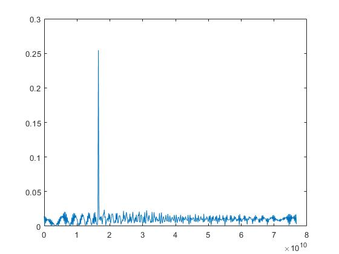
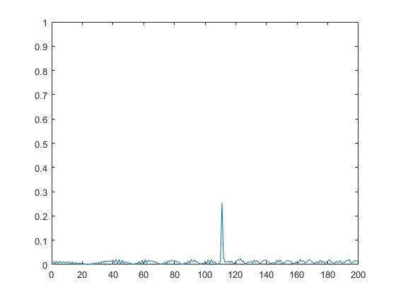
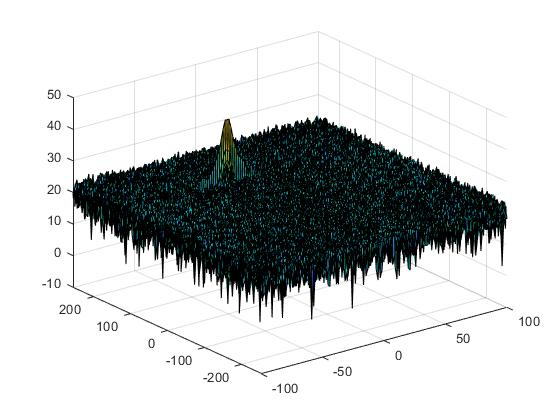

## Radar Target Generation and Detection


### Goal

In this project:


*   Configure the FMCW waveform based on the system requirements.
*   Define the range and velocity of target and simulate its displacement.
*   For the same simulation loop process the transmit and receive signal to determine the beat signal
*   Perform Range FFT on the received signal to determine the Range
*   Towards the end, perform the CFAR processing on the output of 2nd FFT to display the target.


* Refer to `radar_target_generation_and_detection.m`

---
### Radar Specifications 
* Frequency of operation = 77GHz
* Max Range = 200m
* Range Resolution = 1 m
* Max Velocity = 100 m/s
```
Max_Range_of_Radar = 200; 
Max_Velocity_of_Radar = 100;
Range_Resolution_of_Radar = 1;
speed_of_light = 3e8;
```

### User Defined Range and Velocity of target

* define the target's initial position and velocity. 
* Note : Velocity remains constant
```
Range_of_target = 110; % Target Initial Range
Velocity_of_target  = -20; % Target Velocity
```


### Determining the Range

After calculating the beat signal and performing range FTT, the output is




Using the frequency from above, we calculate the range as


```
f = Bsweep*(0:(L/2))/L;
R = (c*Tchirp*f)/(2*Bsweep);
```


### Output of Range estimation:


 


### 2D FTT

The 2D FTT is run on the beat signal output to generate the Range Doppler Map.


 


### 2D CFAR process

The 2-D CFAR detector mitigate a constant false-alarm rate detector for two-dimensional range-Doppler-matrix (RDM). A target is declared when an CUT value exceeds a threshold. 
The detector estimates noise power from neighboring cells surrounding the cell-under-test (CUT) using cell averaging methods. 
For each test cell, the detector:

   -   Estimates the noise statistic from the cell values in the training band surrounding the CUT cell.
   - computes the threshold by multiplying the noise estimate by the threshold factor.
   - compares the CUT cell value to the threshold to determine whether a target is present or absent. If the value is greater than the threshold, a target is present..


#### Implementation Steps


*   The number of Training Cells in both the dimensions are selected

    **Tr = 14**


    **Td = 6**

*   The number of Guard Cells in both dimensions around the Cell under test (CUT) for accurate estimation are selected

    **Gr = 6**


    **Gd = 3**

*   The offset the threshold by SNR value in dB

    **Offset = 6**

*   Slide the Cell Under Test (CUT) across the complete matrix making sure the CUT has margin for Training and Guard cells from the edges.
*   For each iteration we sum the signal level across the training cells and then average is calculated.
*   Offset is added to the threshold to calculate the new threshold.
*   Next, compare the signal under CUT against this threshold.
*   If the CUT signal level is greater than the Threshold, assign a value of 1, else equate it to zero.
*   Since the cell under test are not located at the edges, due to the training cells occupying the edges, we suppress the edges to zero. Any cell value that is neither 1 nor a 0, assign it a zero.


